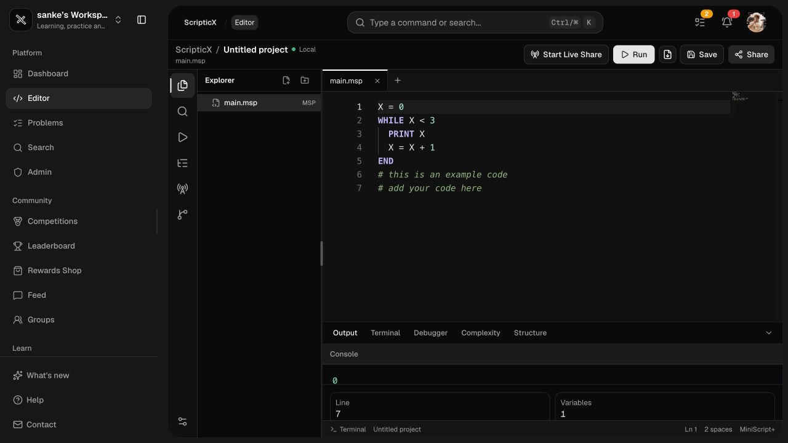
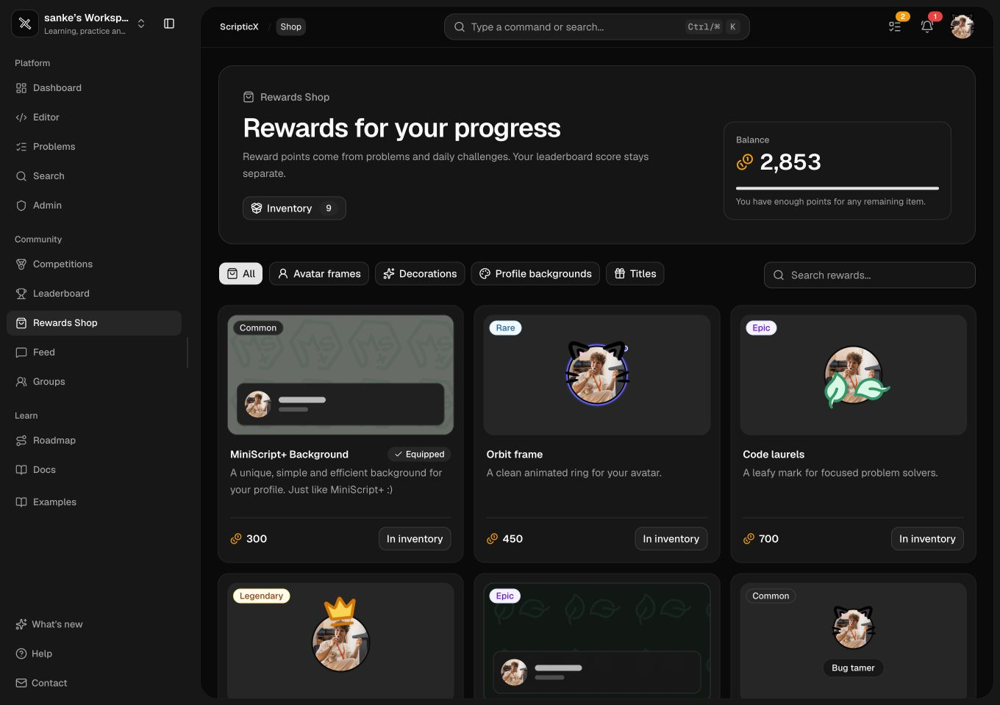

<div align="center">
  
  <p>Learn programming visually, one small idea at a time.</p>
  <p>
    <a href="https://platform.scripticx.org">Open the platform</a> ·
    <a href="https://scripticx.org">Visit the landing page</a>
  </p>

  [](https://github.com/Sank34/scripticx/stargazers)
  [](https://github.com/Sank34/scripticx/blob/main/LICENSE)
  [](https://github.com/Sank34/scripticx/blob/main/package.json)
</div>

ScripticX is a bilingual programming learning platform built around MiniScript+, a small language designed for beginners. The official release brings a guided roadmap, dedicated personal/student/teacher workspaces, an all-new editor, automatically graded problems, Groups, Competitions, Rewards Shop and a community built for learning together.

## Main features

- **All-new editor** — Monaco-based editing, live error highlighting, step-through debugging, project tools and GitHub repository integration.
- **MiniScript+** — readable syntax, localized messages, functions, `FOR` loops and browser execution.
- **Roadmap and lessons** — localized chapters, quizzes, progress gates and recommended practice.
- **Problems** — searchable problem library, automatic grading, chapters and branded PDF downloads.
- **Groups** — channels, image/GIF sharing, named custom emoji and smooth media previews.
- **Competitions** — public and invite-only contests with participant management.
- **Rewards Shop** — earn points, unlock cosmetics and keep owned items in Inventory.
- **Workspaces** — focused experiences for personal, student and teacher accounts.
- **Accessibility mode** — stronger contrast and clearer surfaces for projectors and colour-vision differences.
- **Community** — posts, snippets, mentions, profiles and leaderboards.

## Sneak peek

<div align="center">
  
  <br><br>
  
  <br><br>
  
  <br><br>
  
</div>

## MiniScript+

MiniScript+ keeps the first steps of programming approachable while still teaching real control flow:

```msp
FUNCTION build(x, y)
  RETURN x + y
END

FOR i FROM 1 TO 5 INCR 1
  PRINT build(i, 2)
END
```

`INCR` is optional, and `RETURN` stops the current function and gives its value back to the caller.

## Try it

Use the live platform at [platform.scripticx.org](https://platform.scripticx.org). The landing page is available at [scripticx.org](https://scripticx.org).

To run the platform locally, use Node.js 20+, npm 10+ and a Supabase project:

```bash
git clone https://github.com/Sank34/scripticx.git
cd scripticx
npm install
npm run dev
```

Create `.env.local` with `NEXT_PUBLIC_SUPABASE_URL` and `NEXT_PUBLIC_SUPABASE_ANON_KEY`; the app starts at `http://localhost:3000`.

## Tech stack


ScripticX is developed by ScripticX SRL.
